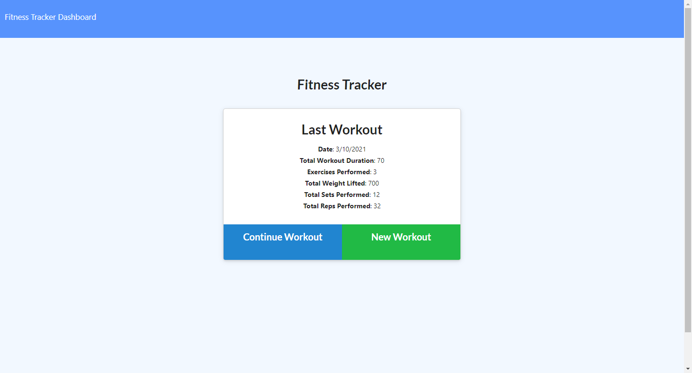

# Unit 17 NoSQL Homework: Workout Tracker

## Description
This is an app that can be used to track daily workouts with specifics for different exercises, and saved to a MongoDB cloud database. The data can be viewed graphically from the "stats" page.

This app is deployed on heroku at [https://jcx-fitness-tracker.herokuapp.com/](https://jcx-fitness-tracker.herokuapp.com/)

## Table of Contents
* [Installation](#installation)
* [Usage](#usage)
* [License](#license)

## Installation
This app can be installed locally by downloading the repo, and requires an existing local MongoDB database server. After downloading the repo, run 'npm install' to install the required packages.

## Usage
Run "node server" to start a local instance of the app.

## License
ISC License: Copyright (C) 2021 JingChang Xiao 

Permission to use, copy, modify, and/or distribute this software for any purpose with or without fee is hereby granted, provided that the above copyright notice and this permission notice appear in all copies. 

THE SOFTWARE IS PROVIDED "AS IS" AND THE AUTHOR DISCLAIMS ALL WARRANTIES WITH REGARD TO THIS SOFTWARE INCLUDING ALL IMPLIED WARRANTIES OF MERCHANTABILITY AND FITNESS. IN NO EVENT SHALL THE AUTHOR BE LIABLE FOR ANY SPECIAL, DIRECT, INDIRECT, OR CONSEQUENTIAL DAMAGES OR ANY DAMAGES WHATSOEVER RESULTING FROM LOSS OF USE, DATA OR PROFITS, WHETHER IN AN ACTION OF CONTRACT, NEGLIGENCE OR OTHER TORTIOUS ACTION, ARISING OUT OF OR IN CONNECTION WITH THE USE OR PERFORMANCE OF THIS SOFTWARE.
